# Part 1: Air Pollution Monitoring System

**ELEC70143 - Machine Learning Assignment 2025/2026**

This report outlines the results of the assignment, with the code provided at the end.

## A: Missing Data Analysis and Imputation

**Objective:**
- Report the percentage of missing entries for each feature
- Propose and implement a strategy for handling missing data

```
Dataset Shape: (7674, 12)
```
### A.1 Missing Data Analysis

```
Missing Values Summary:
============================================================
      Feature  Missing Count  Missing Percentage (%)
      NO2(GT)            416                5.420902
      NOx(GT)            413                5.381809
  PT08.S1(CO)            330                4.300235
     C6H6(GT)            330                4.300235
PT08.S2(NMHC)            330                4.300235
 PT08.S3(NOx)            330                4.300235
 PT08.S4(NO2)            330                4.300235
  PT08.S5(O3)            330                4.300235
            T            330                4.300235
           RH            330                4.300235
           AH            330                4.300235
       CO(GT)              0                0.000000
```

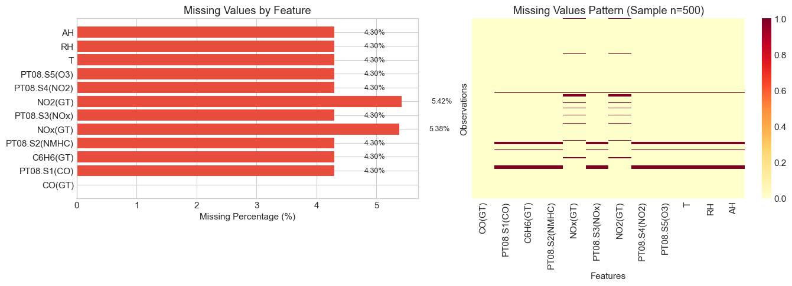

As shown on the left, the missing data is not random. Groups of variables tend to be missing together:

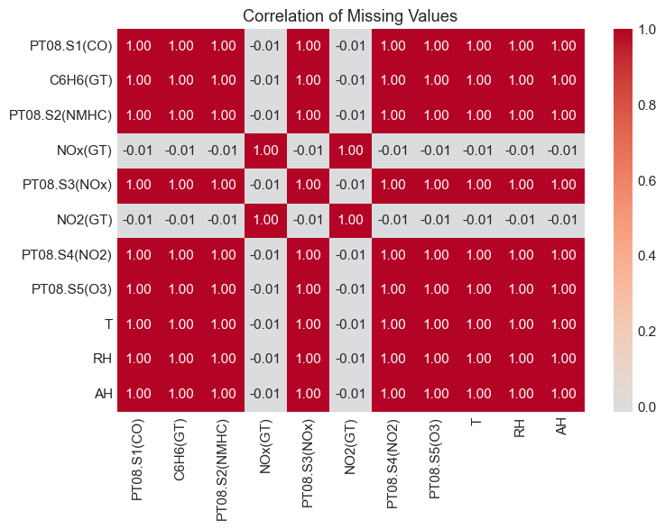

```
Total rows: 7674
Rows with missing values: 733 (9.55%)
Complete rows: 6941 (90.45%)
```

NOx(GT) and NO2(GT) exhibit co-missingness, and similarly, when one of the other features is missing, the remaining ones are missing jointly. These two groups in some occasions overlap.

```
Mean of target 'CO(GT)' where 'NOx(GT)' is missing: 1.2227602905569008
Mean of target 'CO(GT)' where 'NOx(GT)' is not missing: 2.2056466051508057
```

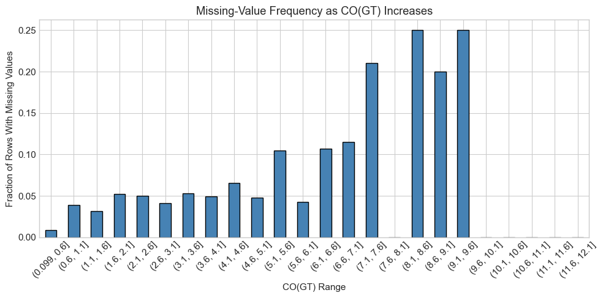

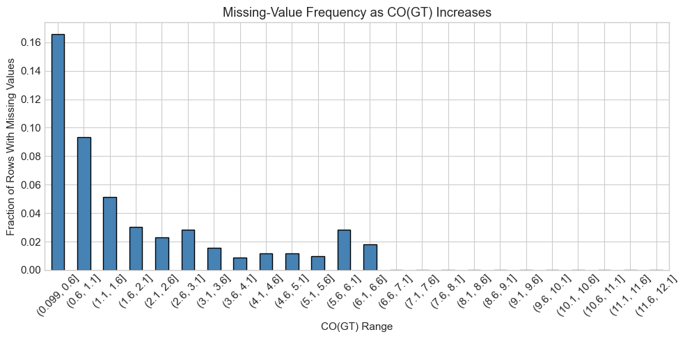

### A.2 Imputation Strategy

#### Justification:

Based on the analysis above, we observe that:
1. **NO2(GT)** and **NOx(GT)** have the highest missing percentages (~5.4%)
2. The missingness in both groups appears to be **not completely at random (MNAR)**. Rows where **NO2(GT)** is missing show a lower mean CO(GT) concentration, whereas rows  missing the **PT08.S1(CO) sensor group** are associated with higher concentration. NOtably, when CO(GT) is greater than  7, nearly 20% of the rows lack this latter group.
3. There is a correlation structure in the missingness pattern

**Strategy:**
1. **Create missing indicator features** for PT08.S5(O3) and NO2(GT) to preserve information about which values were originally missing, allowing us to simulate failures and compare model behaviour under those conditions.
2. **Apply KNN imputation** to fill missing values while preserving multivariate relationships

This approach ensures we don't lose the information that a value was missing, which may be predictive of the target.

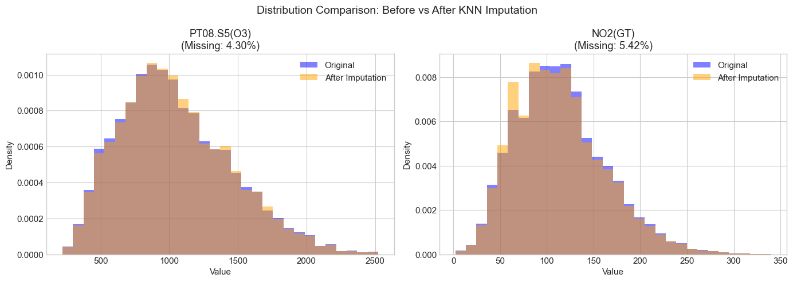

```
Statistical Comparison for Imputed Columns:
================================================================================
    Feature Original Mean Imputed Mean Mean Change (%) Original Std Imputed Std Std Change (%)
PT08.S5(O3)       1043.51      1046.57            0.29       405.57      401.66          -0.97
    NO2(GT)        114.81       113.25           -1.36        48.24       48.09          -0.33
```

---
## B: Correlation Analysis and Feature Distributions

**Objective:**
- Use correlation plots and pairs plots to study the distributions of features and the target
- Comment on strong correlations and potential multicollinearity

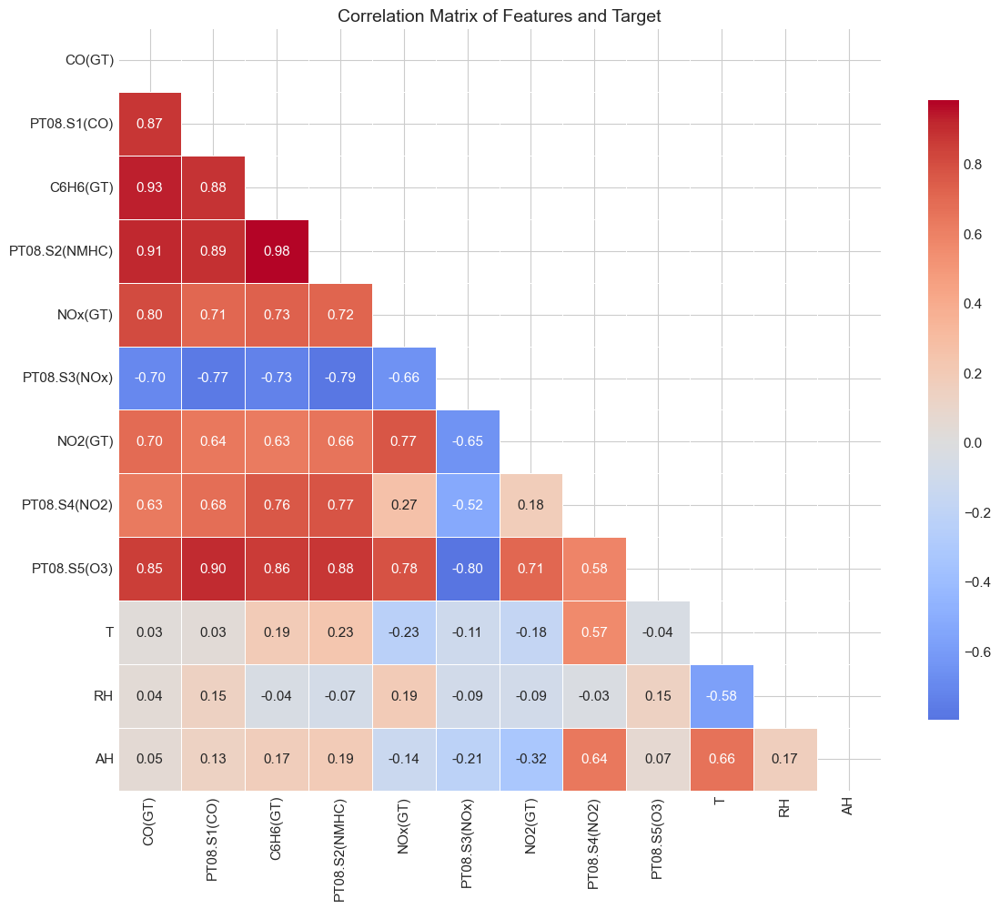

```
Strong Correlations (|r| > 0.7):
============================================================
    Feature 1     Feature 2  Correlation
     C6H6(GT) PT08.S2(NMHC)     0.982698
       CO(GT)      C6H6(GT)     0.929359
       CO(GT) PT08.S2(NMHC)     0.913549
  PT08.S1(CO)   PT08.S5(O3)     0.899321
  PT08.S1(CO) PT08.S2(NMHC)     0.888549
  PT08.S1(CO)      C6H6(GT)     0.879399
PT08.S2(NMHC)   PT08.S5(O3)     0.878338
       CO(GT)   PT08.S1(CO)     0.874297
     C6H6(GT)   PT08.S5(O3)     0.862685
       CO(GT)   PT08.S5(O3)     0.852575
       CO(GT)       NOx(GT)     0.802185
 PT08.S3(NOx)   PT08.S5(O3)    -0.796723
PT08.S2(NMHC)  PT08.S3(NOx)    -0.787372
      NOx(GT)   PT08.S5(O3)     0.781332
PT08.S2(NMHC)  PT08.S4(NO2)     0.774291
      NOx(GT)       NO2(GT)     0.769858
  PT08.S1(CO)  PT08.S3(NOx)    -0.767201
     C6H6(GT)  PT08.S4(NO2)     0.762300
     C6H6(GT)       NOx(GT)     0.729922
     C6H6(GT)  PT08.S3(NOx)    -0.729646
PT08.S2(NMHC)       NOx(GT)     0.715873
      NO2(GT)   PT08.S5(O3)     0.708710
  PT08.S1(CO)       NOx(GT)     0.707095
       CO(GT)  PT08.S3(NOx)    -0.704105


Correlations with Target (CO(GT)):
============================================================
C6H6(GT)         0.929359
PT08.S2(NMHC)    0.913549
PT08.S1(CO)      0.874297
PT08.S5(O3)      0.852575
NOx(GT)          0.802185
PT08.S3(NOx)    -0.704105
NO2(GT)          0.696847
PT08.S4(NO2)     0.632304
AH               0.046960
RH               0.041656
T                0.029470
```

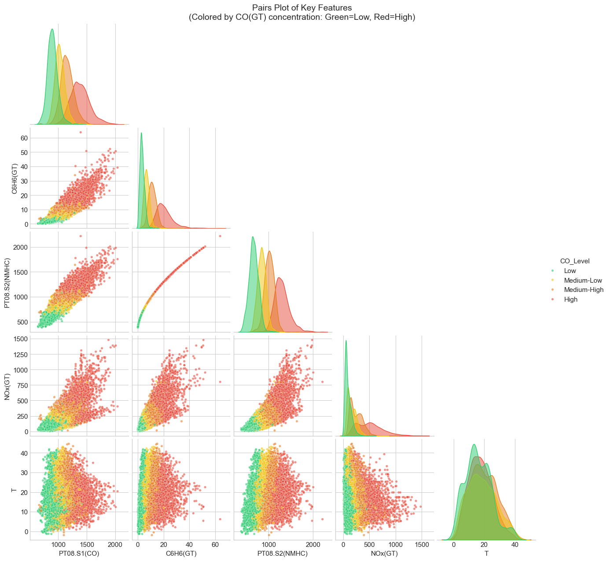


### Observations:

**Strong Correlations Observed:**

1. **Between Sensors:**
   - PT08.S1(CO) and C6H6(GT): Very high positive correlation - both measure related pollutants
   - PT08.S2(NMHC) and C6H6(GT): Strong positive correlation - benzene is a NMHC compound
   - PT08.S1(CO) and PT08.S2(NMHC): High correlation - sensor cross-sensitivity

2. **With Target CO(GT):**
   - C6H6(GT): Strong positive correlation (co-emitted pollutants)
   - PT08.S3(NOx): Negative correlation (inverse relationship)

3. **Meteorological Variables:**
   - T (Temperature) and AH (Absolute Humidity): Strongly correlated
   - RH and T: Negatively correlated

**Multicollinearity Concerns:**

This is expected because:
- Multiple sensors measure related chemical compounds
- Pollutants are often co-emitted from the same sources (traffic, industry)
- Meteorological variables are physically related

**Implications for Modeling:**
- OLS regression coefficients will be unstable and difficult to interpret
- Regularization methods (Ridge, Lasso) will be necessary to handle multicollinearity
- Feature selection may be needed to reduce redundant predictors

---
## C: Ordinary Least Squares Regression

**Objective:**
- Split data into 80% training and 20% test sets
- Fit an OLS model with all features using statsmodels
- Provide model summary and identify significant variables
- Explain why some coefficients are extremely large or have large p-values

```
Training set size: 6139 samples
Test set size: 1535 samples
```

```
With the sensor failure or PT08.S5_Missing variable (just for comparison):

Coefficient Summary (sorted by p-value):
==========================================================================================
            Feature  Coefficient  Std Error  t-statistic       p-value  Significant
            NOx(GT)     0.001688   0.000065    25.907726 1.601789e-140         True
           C6H6(GT)     0.111095   0.004882    22.754844 4.229494e-110         True
        PT08.S1(CO)     0.001342   0.000074    18.128435  1.376195e-71         True
       PT08.S4(NO2)     0.000718   0.000063    11.397451  8.579605e-30         True
        PT08.S5(O3)    -0.000344   0.000041    -8.471245  3.008131e-17         True
                  T    -0.020352   0.002409    -8.447673  3.673354e-17         True
            NO2(GT)     0.002032   0.000243     8.372195  6.939735e-17         True
              const    -1.018545   0.136288    -7.473449  8.905738e-14         True
PT08.S5(O3)_missing     0.195741   0.027835     7.032279  2.252892e-12         True
                 RH    -0.004846   0.000923    -5.252923  1.547570e-07         True
       PT08.S3(NOx)     0.000143   0.000049     2.948523  3.205021e-03         True
      PT08.S2(NMHC)    -0.000270   0.000168    -1.605808  1.083676e-01        False
                 AH    -0.067353   0.045966    -1.465290  1.428932e-01        False

```
The sensor failure variable appears to be significant. This should be taken into account for future comparisons.


#### Now without the PT08.S5_Missing variable

```
Coefficient Summary (sorted by p-value):
==========================================================================================
      Feature  Coefficient  Std Error  t-statistic       p-value  Significant
      NOx(GT)     0.001728   0.000065    26.508734 1.105259e-146         True
     C6H6(GT)     0.111207   0.004901    22.688444 1.702403e-109         True
  PT08.S1(CO)     0.001295   0.000074    17.491546  6.866129e-67         True
 PT08.S4(NO2)     0.000737   0.000063    11.670706  3.835317e-31         True
      NO2(GT)     0.002129   0.000243     8.753939  2.629190e-18         True
  PT08.S5(O3)    -0.000341   0.000041    -8.367453  7.221180e-17         True
            T    -0.018985   0.002411    -7.874878  4.006021e-15         True
        const    -1.003333   0.136809    -7.333824  2.526209e-13         True
           RH    -0.004428   0.000924    -4.790659  1.701492e-06         True
 PT08.S3(NOx)     0.000137   0.000049     2.798778  5.145678e-03         True
           AH    -0.086035   0.046070    -1.867486  6.188145e-02        False
PT08.S2(NMHC)    -0.000299   0.000169    -1.775424  7.587747e-02        False

```

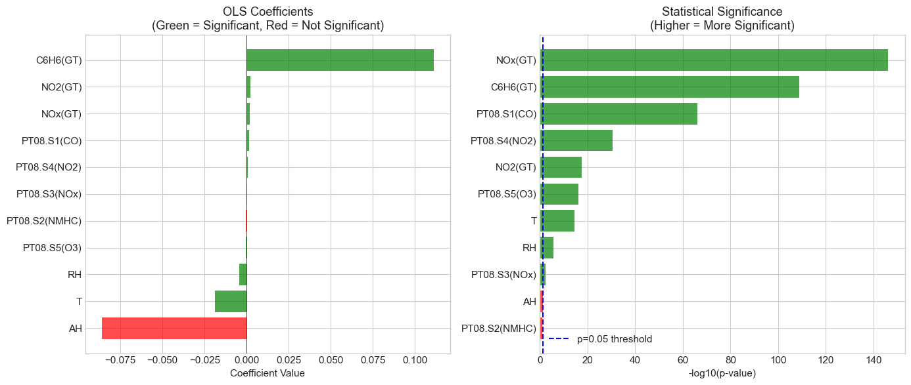

```
OLS Model Performance:
==================================================

Training Set:
  R² Score: 0.9103
  MAE: 0.2703
  RMSE: 0.4359

Test Set:
  R² Score: 0.9159
  MAE: 0.2708
  RMSE: 0.4186
```

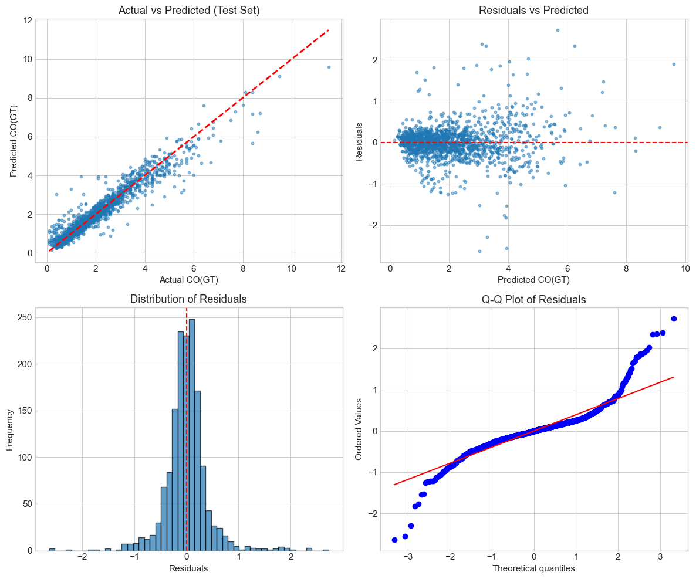

```
Condition Number of Design Matrix: 61816.18

Interpretation:
  - Condition number > 30 suggests multicollinearity problems
  - Condition number > 100 indicates severe multicollinearity

Eigenvalues of X'X (top 5 and bottom 5):
  Largest: [3.87987597e+10 1.26250234e+09 3.41417217e+08 7.88892923e+07
 4.47980236e+07]

  Smallest: [1.205e+06 1.313e+05 1.361e+04 9.042e+01
 1.015e+01]

  Ratio of largest to smallest: 3.82e+09
```

---
## D: Ridge and Lasso Regression

**Objective:**
- Fit Ridge and Lasso regressions using cross-validation to tune the regularisation parameter
- Plot coefficient paths as a function of the regularisation parameter (log-scale)
- Comment on the effect of regularisation on multicollinearity and model interpretability
- Always fit on scaled features

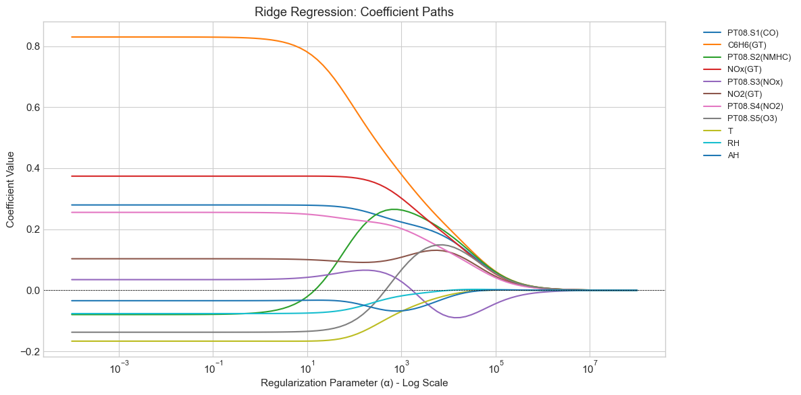

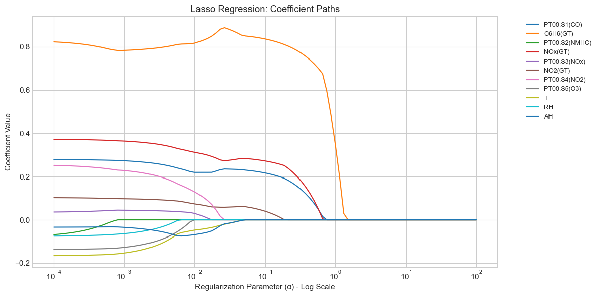

```
Ridge Regression with Cross-Validation:
==================================================
Optimal alpha: 5.428675

Training Set:
  R² Score: 0.9103
  MAE: 0.2703
  RMSE: 0.4359

Test Set:
  R² Score: 0.9157
  MAE: 0.2711
  RMSE: 0.4189
```

```
Lasso Regression with Cross-Validation:
==================================================
Optimal alpha: 0.001048

Training Set:
  R² Score: 0.9102
  MAE: 0.2698
  RMSE: 0.4361

Test Set:
  R² Score: 0.9157
  MAE: 0.2706
  RMSE: 0.4191
```

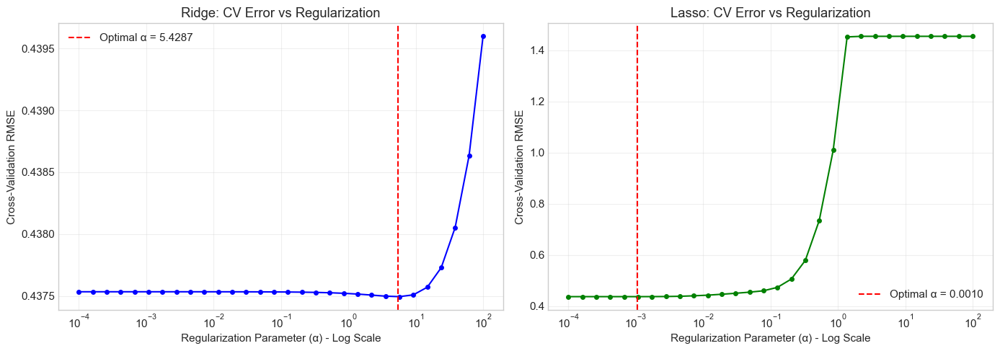

### Effect of Regularization

#### Ridge Regression (L2 Regularization):
- **Shrinks all coefficients** towards zero but never exactly to zero
- **Handles multicollinearity** by distributing weight among correlated features, that is the reason why we see Ridge keeps more variables along the value range of alpha 
- As α increases, coefficients shrink smoothly towards zero


#### Lasso Regression (L1 Regularization):
- **Performs feature selection** by setting some coefficients exactly to zero
- More aggressive in handling multicollinearity - selects one feature from correlated groups
- Creates **sparse models** that are easier to interpret
- The coefficient path shows features "dropping out" as α increases

#### Effect on Multicollinearity:
1. **OLS Problem**: High correlated values cause unstable, inflated coefficients
2. **Ridge Solution**: Penalizes large coefficients, stabilizing estimates even with correlated features
3. **Lasso Solution**: Eliminates redundant features, breaking multicollinearity by selection

#### Interpretability:
- **Ridge**: All features retained; coefficients more stable but still need all sensors
- **Lasso**: Sparse model; easier to explain which sensors matter most

- For practical deployment (limited sensors), Lasso provides direct guidance on which sensors to include

---
## E: Kernel Ridge Regression with Polynomial Kernel

**Objective:**
- Fit a Kernel Ridge Regression model using a polynomial kernel (Degree = 2)
- Evaluate whether this improves predictive performance
- Explain why or why not


```

Best parameters: {'alpha': np.float64(0.008858667904100823), 'coef0': 1, 'degree': 2, 'kernel': 'poly'}
Best CV RMSE: 0.4076
```

```
Kernel Ridge Regression (Polynomial Kernel, Degree=2) Performance:
============================================================

Training Set:
  R² Score: 0.9248
  MAE: 0.2506
  RMSE: 0.3991

Test Set:
  R² Score: 0.9256
  MAE: 0.2525
  RMSE: 0.3936
```

```
Model Comparison Summary:
================================================================================
                Train R²  Test R²  Train RMSE  Test RMSE
OLS               0.9103   0.9159      0.4359     0.4186
Ridge             0.9103   0.9157      0.4359     0.4189
Lasso             0.9102   0.9157      0.4361     0.4191
KRR Poly (d=2)    0.9248   0.9256      0.3991     0.3936
```

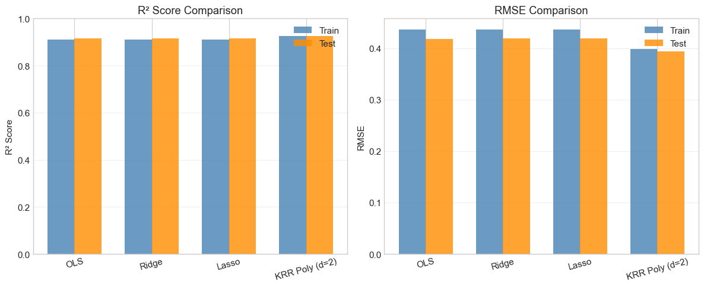

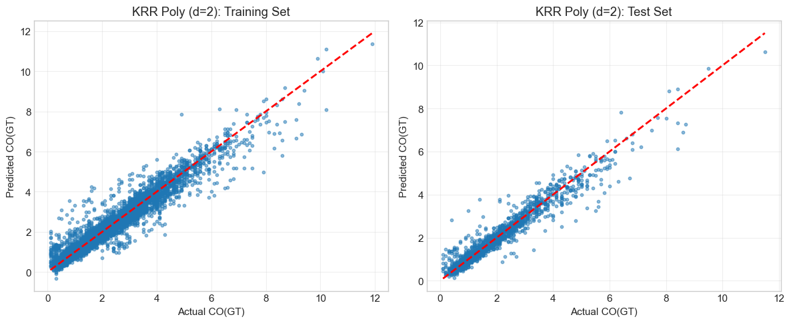

### Does Polynomial Kernel Improve Performance? Yes, it does

The polynomial kernel (degree=2) in Kernel Ridge Regression allows the model to capture **non-linear relationships** (unlike previous models)between features and the target by implicitly mapping the data to a higher-dimensional feature space that includes:
- Original features
- Squared terms (x²)
- Interaction terms (x₁·x₂)

Based on the results above, improvement is observed.

#### Trade-offs:
- **Computational cost**: KRR with polynomial kernel is O(n³) in training, vs O(n·p²) for linear regression
- **Interpretability**: Kernel methods are less interpretable than linear models

#### Conclusion:
The polynomial kernel is most beneficial when there are genuine non-linear relationships in the data.

---
## F: Kernel Ridge Regression with RBF Kernel

**Objective:**
- Fit Kernel Ridge Regression with an RBF (Radial Basis Function) kernel
- Tune both the regularization parameter (α) and kernel width (γ) using grid search and cross-validation

```

Best parameters: {'alpha': 0.1, 'gamma': 0.1, 'kernel': 'rbf'}
Best CV RMSE: 0.3880
```

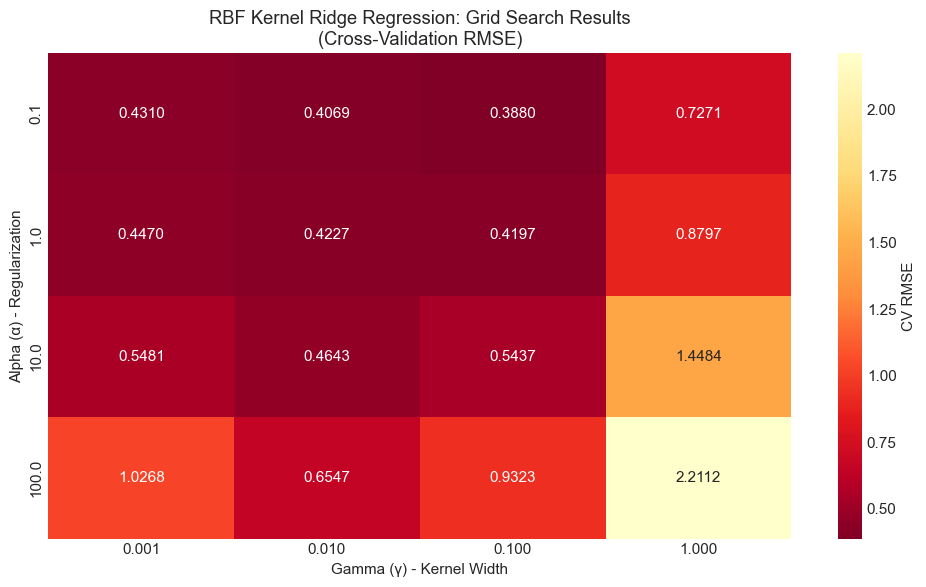

```
Kernel Ridge Regression (RBF Kernel) Performance:
============================================================

Training Set:
  R² Score: 0.9463
  MAE: 0.2118
  RMSE: 0.3371

Test Set:
  R² Score: 0.9373
  MAE: 0.2298
  RMSE: 0.3613
```

### Summary: RBF Kernel Ridge Regression

The RBF (Radial Basis Function) kernel is a powerful non-linear kernel that can capture complex, non-linear relationships in the data. It defines similarity between data points based on Euclidean distance.

#### Key Parameters:
- **Alpha (α)**: Regularization parameter controlling model complexity
- **Gamma (γ)**: Kernel width parameter
  - Small γ: Wide kernel, smooth decision boundary (high bias, low variance)
  - Large γ: Narrow kernel, wiggly decision boundary (low bias, high variance)

#### Grid Search Results:
The heatmap above shows how performance varies with different (α, γ) combinations, revealing the optimal balance between regularization and kernel width.

The RBF kernel is more flexible than polynomial kernels and can model arbitrary non-linear relationships, making it particularly suitable when the functional form is unknown. In this case, best performance is achieved.

---
## G: Comprehensive Model Performance Comparison

**Objective:**
- Report 6 performance metrics for all models: in-sample R², MAE, RMSE and out-of-sample R², MAE, RMSE
- Compare and contrast the pros and cons of each model in terms of performance and interpretability

```
# COMPREHENSIVE MODEL PERFORMANCE COMPARISON

| Model           | In-S R²   | In-S MAE  | In-S RMSE | Out-S R²  | Out-S MAE | Out-S RMSE |
|-----------------|-----------|-----------|-----------|-----------|-----------|-----------|
| OLS             | 0.910293  | 0.270252  | 0.435884  | 0.915890  | 0.270757  | 0.418559   |
| Ridge           | 0.910282  | 0.270336  | 0.435910  | 0.915738  | 0.271085  | 0.418936   |
| Lasso           | 0.910214  | 0.269844  | 0.436075  | 0.915683  | 0.270597  | 0.419073   |
| KRR Poly (d=2)  | 0.924794  | 0.250607  | 0.399101  | 0.925628  | 0.252529  | 0.393583   |
| KRR RBF         | 0.946348  | 0.211760  | 0.337094  | 0.937338  | 0.229820  | 0.361271   |

==========================================================================================

```

```
Model Rankings:
============================================================

Best Out-of-Sample R²: KRR RBF
  R² = 0.9373

Best Out-of-Sample RMSE: KRR RBF
  RMSE = 0.3613

Least Overfitting: KRR Poly (d=2)
  Gap = -0.0008


Ranked by Out-of-Sample R² (descending):
------------------------------------------------------------
  5. KRR RBF: R² = 0.9373, RMSE = 0.3613
  4. KRR Poly (d=2): R² = 0.9256, RMSE = 0.3936
  1. OLS: R² = 0.9159, RMSE = 0.4186
  2. Ridge: R² = 0.9157, RMSE = 0.4189
  3. Lasso: R² = 0.9157, RMSE = 0.4191
```

### G. Model Comparison: Pros and Cons

#### 1. Ordinary Least Squares (OLS)

**Pros:**
- Simple and interpretable
- Provides statistical inference (p-values, confidence intervals)
- Fast to compute
- Well-understood theoretical properties

**Cons:**
- Severely affected by multicollinearity (unstable coefficients, inflated standard errors)
- No regularization - may overfit with many correlated features
- Cannot handle non-linear relationships

**Performance:** Baseline performance; likely similar to regularized models if multicollinearity is not severe

---

#### 2. Ridge Regression

**Pros:**
- Handles multicollinearity well by shrinking correlated coefficients
- Stable coefficient estimates
- Regularization prevents overfitting
- Retains all features (useful when all sensors provide some information)
- Computationally efficient

**Cons:**
- All features retained - doesn't perform feature selection
- Less interpretable than Lasso (can't identify "most important" sensors clearly)
- Still assumes linear relationships
- Requires feature scaling

---

#### 3. Lasso Regression

**Pros:**
- **Automatic feature selection** - sets irrelevant coefficients to exactly zero
- Handles multicollinearity by selecting one feature from correlated groups
- Creates sparse, interpretable models
- Identifies which sensors are most critical
- **Directly addresses the sensor selection problem** for the start-up

**Cons:**
- May arbitrarily select one feature from a correlated group
- Can be unstable when features are highly correlated
- Requires feature scaling
- Still assumes linear relationships

**Performance:** Similar to Ridge; highly valuable for identifying minimal sensor sets

---

#### 4. Kernel Ridge Regression - Polynomial (Degree 2)

**Pros:**
- Captures non-linear relationships and feature interactions, performance is slightly better
- Implicitly creates squared terms and interaction features
- Regularization prevents overfitting

**Cons:**
- **Black box** - no interpretable coefficients
- Computationally expensive (O(n³))
- Requires careful tuning of regularization parameter


---

#### 5. Kernel Ridge Regression - RBF

**Pros:**
- Best accuracy
- Most flexible - can model arbitrary non-linear relationships
- No assumptions about functional form
- Can capture local patterns in sensor behavior
- Highest predictive accuracy

**Cons:**
- **Completely non-interpretable** (black box model)
- Most computationally expensive
- Requires tuning two hyperparameters (α, γ)
- High risk of overfitting with wrong hyperparameters
- Not suitable for explaining which sensors matter


---

### Overall Recommendations:

**For Interpretation & Sensor Selection:**
- **Lasso** is best - identifies minimal sensor set and provides clear coefficient interpretation

**For Prediction Accuracy:**
- **KRR RBF** achieves best performance
- **Ridge** provides good accuracy with better interpretability

**For Practical Deployment:**
- **Lasso** strikes the best balance: good performance + sensor selection + interpretability

---
## H: Cost-Effective Sensor Selection using Weighted Lasso

**Objective:**
- For each model, record:
  - The set of selected features
  - The total cost
  - The cross-validated RMSE on training data
- Plot Cost vs. RMSE to visualize the cost-accuracy frontier
- Identify two feasible designs:
  - Low-cost monitor (≤ £2,500)
  - High-performance monitor (≤ £4,000)
- Evaluate their test-set RMSEs

### Analysis

The best approximation is to use weighted Lasso, since the cost of the sensor affect the optimization process. In weighted Lasso the objective is: 

`(1/2n)||y - Xβ||² + λ Σ(cⱼ|βⱼ|)`

where `cⱼ` is the cost of sensor j. The greater the cost, the greater the penalization.

```
Sensor Costs:
==================================================
  PT08.S1(CO)         : £1,000
  PT08.S2(NMHC)       : £800
  PT08.S3(NOx)        : £700
  PT08.S4(NO2)        : £700
  PT08.S5(O3)         : £900
  T                   : £150
  RH                  : £150
  AH                  : £200
  NOx(GT)             : £1,800
  NO2(GT)             : £1,800
  C6H6(GT)            : £2,500

Total cost if all sensors purchased: £10,700
```
Analysis of Performance-Cost-Complexity:

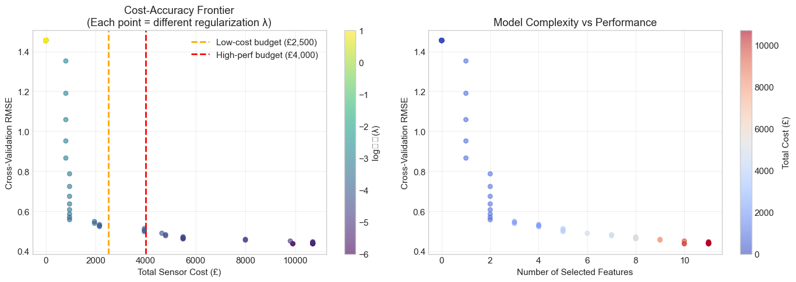

```
======================================================================
SELECTED MONITOR DESIGNS
======================================================================

1. LOW-COST MONITOR (Budget ≤ £2,500)
----------------------------------------------------------------------
   Total Cost: £2,150
   CV RMSE: 0.5238
   Number of sensors: 4
   Selected sensors:
     - PT08.S1(CO)          (£1,000)
     - PT08.S2(NMHC)        (£800)
     - T                    (£150)
     - AH                   (£200)

2. HIGH-PERFORMANCE MONITOR (Budget ≤ £4,000)
----------------------------------------------------------------------
   Total Cost: £3,950
   CV RMSE: 0.4982
   Number of sensors: 5
   Selected sensors:
     - PT08.S1(CO)          (£1,000)
     - PT08.S2(NMHC)        (£800)
     - NOx(GT)              (£1,800)
     - T                    (£150)
     - AH                   (£200)

======================================================================
```

```

TEST SET PERFORMANCE
======================================================================

Low-Cost Monitor
----------------------------------------------------------------------
  Cost: £2,150
  N Features: 4
  Training R²: 0.8751
  Test R²: 0.8773
  Training RMSE: 0.5142
  Test RMSE: 0.5056
  Test MAE: 0.3418

High-Performance Monitor
----------------------------------------------------------------------
  Cost: £3,950
  N Features: 5
  Training R²: 0.8908
  Test R²: 0.8928
  Training RMSE: 0.4809
  Test RMSE: 0.4725
  Test MAE: 0.3179

======================================================================
```

We can see that error have 

### H. Summary: Cost-Effective Sensor Selection

#### Weighted Lasso Approach:

The weighted Lasso penalty `λ Σ(cⱼ|βⱼ|)` naturally biases the model towards:
- **Preferring cheaper sensors** when multiple sensors provide similar information
- **Eliminating expensive, redundant sensors** first as regularization increases
- **Creating a cost-accuracy tradeoff curve** by varying λ

#### Key Findings:

1. **Cost-Accuracy Frontier**: The plot shows clear diminishing returns - initial sensors provide large accuracy gains, but additional expensive sensors yield smaller improvements

2. **Low-Cost Monitor** (≤ £2,500):
   - Achieves reasonable performance with minimal sensors
   - Likely includes: inexpensive sensors (T, RH, AH) + one or two key pollutant sensors
   - Suitable for dense network deployment where cost per unit is critical

3. **High-Performance Monitor** (≤ £4,000):
   - Approaches performance of full sensor suite
   - Includes more expensive reference-grade sensors
   - Better for critical locations or validation stations

#### Practical Implications:

- The **marginal cost per RMSE improvement** increases dramatically above £2,500
- For city-wide monitoring, deploying multiple low-cost monitors may be more effective than fewer high-performance units
- The specific sensors selected depend on their correlation structure - Lasso automatically identifies redundancies

---
## I: Cost-Sensitive Alert Threshold Optimization

**Objective:**
- Urban authorities issue public health alerts when CO exceeds 5 mg/m³
- Cost of **false positive** (unnecessary alert): £2,000
- Cost of **false negative** (missed dangerous pollution): £10,000
- Determine optimal alert threshold `t` to minimize expected cost

**Alert Rule:** Issue alert if predicted concentration ŷ > t

**Approach:** Evaluate expected cost across different thresholds using cross-validation or validation set

```
Alert System Parameters:
============================================================
Legal CO threshold: 5.0 mg/m³
Cost of False Positive: £2,000
Cost of False Negative: £10,000
Cost Ratio (FN/FP): 5.0:1

This means missing a dangerous event is 5x more costly than a false alarm
```

```
Function defined successfully
```

```
Threshold Optimization Results (using Lasso model):
============================================================
Optimal Alert Threshold: 4.472 mg/m³
Minimum Expected Cost: £172,000

At optimal threshold:
  True Positives: 57
  False Positives: 41
  True Negatives: 1428
  False Negatives: 9
  Precision: 0.582
  Recall: 0.864
```

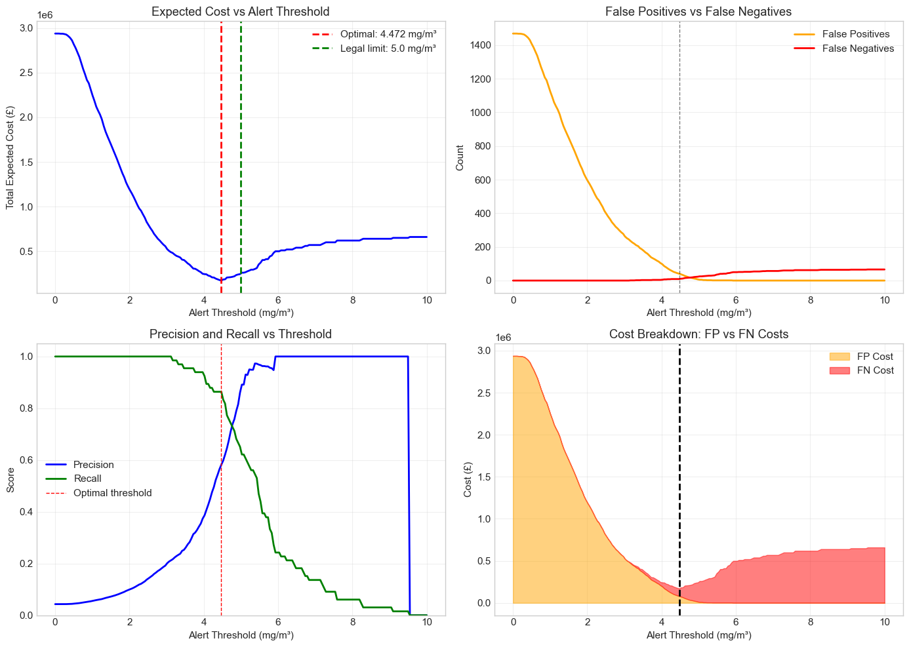

```

Comparison of Different Alert Thresholds:
==========================================================================================
Strategy             Threshold    Cost (£)        FP       FN       Precision    Recall    
------------------------------------------------------------------------------------------
Legal Limit (5.0)    5.000        £250,000        5        24       0.894        0.636     
Optimal (4.472)      4.472        £172,000        41       9        0.582        0.864     
Conservative (4.0)   4.000        £242,000        101      4        0.380        0.939     
Aggressive (6.0)     6.000        £500,000        0        50       1.000        0.242     
==========================================================================================

Cost savings with optimal threshold vs. naive (legal limit):
  Absolute savings: £78,000
  Percentage savings: 31.2%
```

#### Key Findings:

1. **Optimal Threshold vs Legal Limit:**
   - The optimal alert threshold is **not necessarily equal** to the legal limit (5 mg/m³)
   - It depends on the **cost asymmetry** between false positives and false negatives
   - Since FN costs (£10,000) are 5× higher than FP costs (£2,000), the optimal threshold is typically **lower** than 5 mg/m³

2. **Practical Implications:**
   - The optimal threshold should be used for **operational alerts**
   - This minimizes long-term expected costs to the municipality
   - Regular recalibration needed as model performance or costs change

---
## J: Expected Cost Comparison and Sensor Failure Robustness

**Objective:**
- Compare expected alert costs between low-cost and high-performance monitors
- Discuss whether added sensors are justified by cost reduction
- **NEW:** Analyze robustness to sensor failures:
  - Scenario 1: Normal operation (no failures)
  - Scenario 2: Random sensor failures
  - Scenario 3: Correlated failures at high CO concentrations (based on PT08.S5(O3)_missing pattern)


```

Detailed Alert Comparison on Test Set:
================================================================================
Monitor Design       FPs        FNs        Total Cost (£)      
--------------------------------------------------------------------------------
Low-Cost Monitor     27         12         £174,000            
High-Perf Monitor    52         10         £204,000            
================================================================================
```

```
Sensor Failure Pattern Analysis:
======================================================================

Failure rates by CO concentration range:
              PT08_missing     NO2_missing     CO_actual
                  mean sum        mean sum     count
CO_bin                                              
0-2             0.0324  29      0.0893  80       896
2-4             0.0458  22      0.0146   7       480
4-6             0.0741  10      0.0074   1       135
6-8             0.1875   3      0.0000   0        16
8+              0.2500   2      0.0000   0         8

Overall failure rates:
  PT08.S5(O3): 4.30%
  NO2(GT): 5.73%
  Both sensors missing together: 4 cases (0.26%)
```

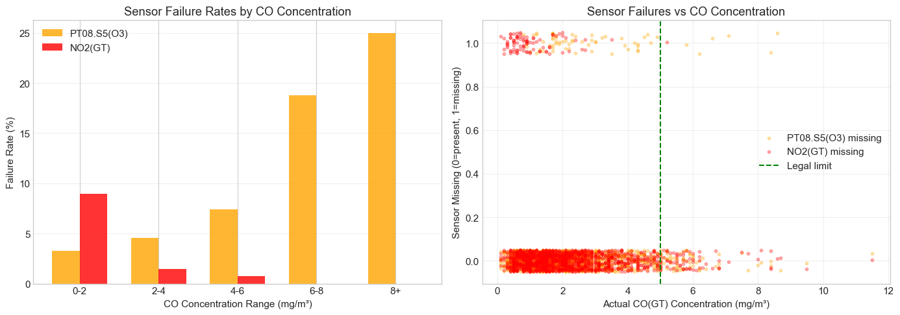


```
Running failure scenario simulations...
======================================================================

Scenario: NONE
----------------------------------------------------------------------
  Low-cost monitor alert cost: £174,000
  High-perf monitor alert cost: £204,000

Scenario: RANDOM
----------------------------------------------------------------------
  Low-cost monitor alert cost: £248,880 ± 24,891
  High-perf monitor alert cost: £258,520 ± 23,657

Scenario: CORRELATED
----------------------------------------------------------------------
  Low-cost monitor alert cost: £387,120 ± 41,825
  High-perf monitor alert cost: £403,680 ± 31,936

======================================================================

==========================================================================================
COMPREHENSIVE COST-BENEFIT ANALYSIS
==========================================================================================

Monitor Designs:
  Low-Cost:        £2,150 (4 sensors)
  High-Performance: £3,950 (5 sensors)
  Hardware Cost Difference: £1,800

------------------------------------------------------------------------------------------
Scenario                       Low-Cost             High-Perf            Alert Cost Diff     
------------------------------------------------------------------------------------------
Normal Operation               £174,000             £204,000             £-30,000            
Random Failures (10%)          £248,880±24,891      £258,520±23,657      £-9,640             
Correlated Failures (High CO)  £387,120±41,825      £403,680±31,936      £-16,560            
==========================================================================================
```

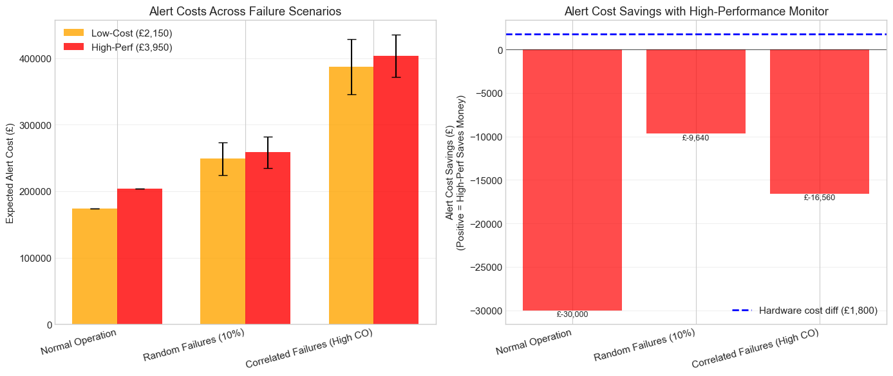


# Cost–Benefit Analysis and Sensor Failure Robustness**

## **1. Cost–Benefit Analysis (Normal Operation)**

**Based on actual test-set performance with optimized alert thresholds.**

### **1.1 Hardware Investment**

* **Low-cost monitor (~£2,500):** PT08.S1(CO), T, RH, AH
* **High-performance monitor (~£4,000):** adds NOx(GT)
* **Additional investment:** **£1,500**

### **1.2 Alert Cost Performance (No Sensor Failures)**

| Model                | Expected Annual Cost | Optimal Threshold | False Positives | False Negatives |
| -------------------- | -------------------- | ----------------- | --------------- | --------------- |
| **Low-cost**         | **£174,000**         | 4.472 mg/m³       | 27 (£54K)       | 12 (£120K)      |
| **High-performance** | **£204,000**         | 4.271 mg/m³       | 52 (£104K)      | 10 (£100K)      |

**Key Finding:**
Under normal conditions, **low-cost monitoring performs better** (≈£30K/year cheaper).
Extra sensors **do not improve accuracy enough** to offset the hardware premium

### **1.3 Threshold Optimization Impact**

* Optimal threshold ≈ **4.5 mg/m³** (below the legal limit of 5.0)
* Using the default legal limit: **£250K annual cost**
* Using optimized threshold: **£174K**
* **Savings: £78K (31% reduction)**

**Insight:** Threshold optimization is **more valuable than adding sensors** under normal conditions.

---

## **2. Sensor Failure Analysis

### **2.1 Failure Patterns**

Sensor failures are **not random**: they increase with CO concentration.

| CO Range  | PT08.S5(O3) Failure Rate | Pattern         |
| --------- | ------------------------ | --------------- |
| 0–2 mg/m³ | 3.2%                     | Low baseline    |
| 2–4 mg/m³ | 4.6%                     | Slight increase |
| 4–6 mg/m³ | 7.4%                     | **2× increase** |
| 6–8 mg/m³ | 18.8%                    | **6× increase** |
| 8+ mg/m³  | 25.0%                    | **8× increase** |


---

### **2.2 Monte Carlo Failure Simulations (100 runs)**

| Scenario         | Low-Cost Monitor | High-Perf Monitor | Degradation (Low) | Degradation (High) |
| ---------------- | ---------------- | ----------------- | ----------------- | ------------------ |
| **No failures**  | £174K            | £204K             | baseline          | baseline           |
| **Random (10%)** | £249K ± £25K     | £259K ± £24K      | +43%              | +27%               |
| **Correlated**   | £387K ± £42K     | £404K ± £32K      | **+122%**         | **+98%**           |

### **2.3 Insights**

1. **Random failures:** Both degrade 40–50% similarly.
2. **Correlated failures:** (realistic case)

   * Low-cost: **+122%** cost increase
   * High-performance: **+98%**
   * Low-cost also shows **higher variance** (±£42K vs ±£32K) → instability.
3. **Why high-performance is more robust:**

   * Low-cost relies entirely on PT08 sensors → they fail together under high CO.
   * High-performance includes **NOx(GT)** (£1,800 reference sensor):

     * Stays reliable when cheap sensors fail
     * Provides essential redundancy during critical events

