# Part 2: Detecting Cyber Attacks from Network Flows - Comprehensive Report

**ELEC70143 - Machine Learning Assignment 2025/2026**

---

## Executive Summary

This report presents a comprehensive analysis of machine learning approaches for detecting cyber attacks from network traffic data. The UK National Cyber Security Centre (NCSC) must detect malicious traffic in national infrastructure with minimal false negatives (missed attacks cost £1M) while managing false positives (unnecessary investigations cost £1K).

We evaluate multiple classification models including:
- Baseline Logistic Regression
- L1-Penalised Logistic Regression (with feature selection)
- Linear Support Vector Machines (hard and soft margin)
- Kernel SVM with RBF kernel

All models are optimized for cost-sensitive decision-making, where the asymmetric cost structure (FN >> FP) requires careful threshold tuning.

---

# Part 2: Detecting Cyber Attacks from Network Flows

**Objective:** Detect malicious DDoS traffic in national infrastructure using flow-level features.

**Dataset:** q2.csv - Network flow data with benign and malicious traffic

**Cost Structure:**
- False Negative (missing an attack): £1,000,000
- False Positive (false alarm): £1,000
- **FN:FP cost ratio = 1000:1**

---

```
Libraries imported successfully
```

---

# A: Comprehensive Exploratory Data Analysis (REVISAR)

An extensive EDA is performed:

1. **Basic Statistics & Class Balance**
2. **Univariate Analysis: Protocol Analysis (Categorical Data)**
3. **Univariate Analysis: Numerical Data** (multivariate)
4. **Multivariate Analysis**
5. **Correlation Analysis and Mutual Information**
6. **Summary of Comprehensive EDA Findings**

```
======================================================================
DATASET OVERVIEW
======================================================================

Shape: 10000 rows × 14 columns

Column names:
   1. Flow Duration
   2. Total Fwd Packets
   3. Total Backward Packets
   4. Total Length of Fwd Packets
   5. Total Length of Bwd Packets
   6. Flow IAT Mean
   7. Flow IAT Std
   8. Packet Length Mean
   9. Packet Length Std
  10. Average Packet Size
  11. Active Mean
  12. Idle Mean
  13. Protocol
  14. target

Data types:
Flow Duration                    int64
Total Fwd Packets                int64
Total Backward Packets           int64
Total Length of Fwd Packets    float64
Total Length of Bwd Packets    float64
Flow IAT Mean                  float64
Flow IAT Std                   float64
Packet Length Mean             float64
Packet Length Std              float64
Average Packet Size            float64
Active Mean                    float64
Idle Mean                      float64
Protocol                         int64
target                           int64
dtype: object

Memory usage: 1.07 MB

Missing values:
  No missing values detected ✓

First 5 rows:
```

## A.1: Class Balance Analysis

```
======================================================================
CLASS BALANCE ANALYSIS
======================================================================

Class Distribution:
  BENIGN (0):     5000 samples (50.00%)
  MALICIOUS (1):  5000 samples (50.00%)

Imbalance Ratio: 1.00:1
✓ Dataset is relatively balanced
```

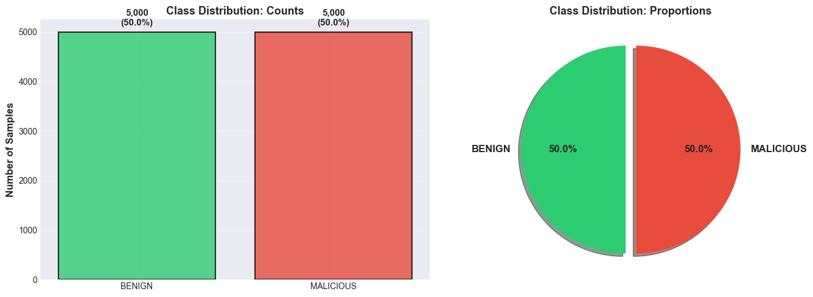


## A.2: Univariate Analysis: Protocol Analysis (Categorical Data)

```
======================================================================
PROTOCOL ANALYSIS
======================================================================

Protocol Distribution:
  HOPOPT       ( 0):     89 ( 0.89%)
  TCP          ( 6):   8449 (84.49%)
  UDP          (17):   1462 (14.62%)

Protocol Distribution by Class:
        BENIGN  MALICIOUS
HOPOPT    1.78        0.0
TCP      69.08       99.9
UDP      29.14        0.1
```

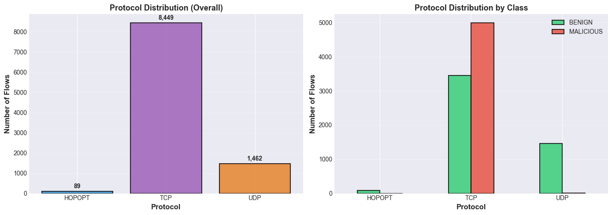


## A.3: Univariate Analysis: Numerical Data

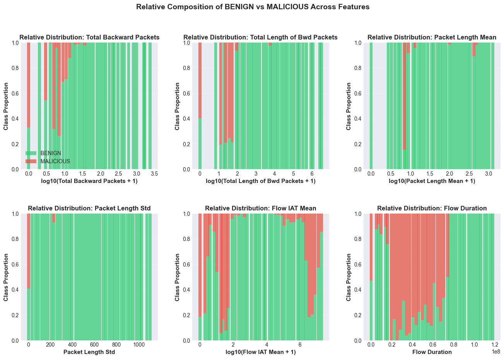

## A.4 Multivariate Analysis

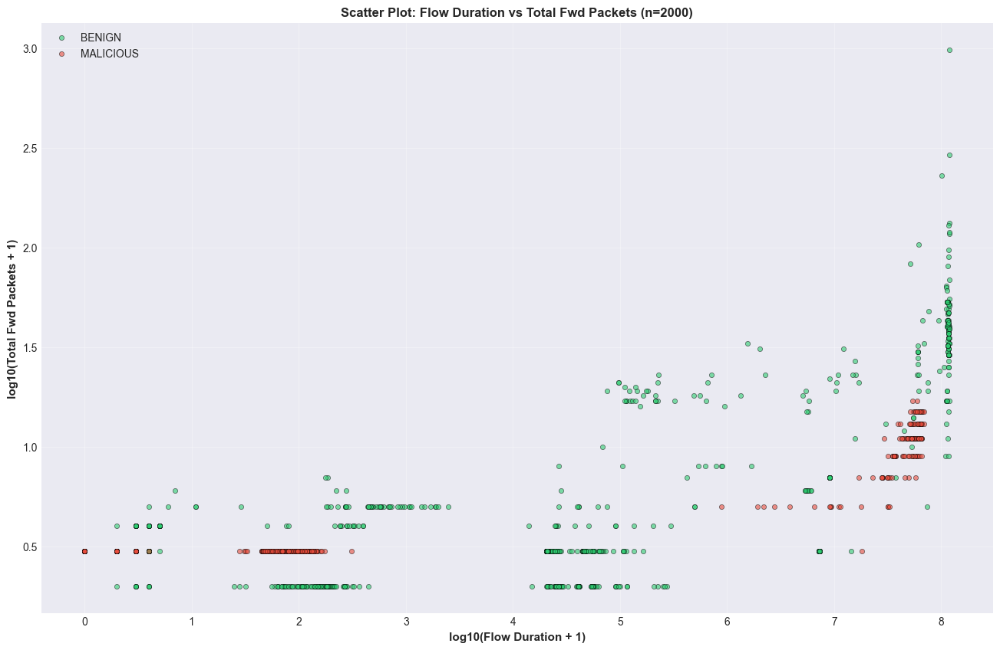


### **Insights of the below bubble charts**

The visual analysis of flow-level network features of the bubble charts below, reveals a clear and consistent behavioural separation between benign and malicious traffic. Benign flows exhibit the full variability typical of real network use: they are longer-lived, bidirectional, and characterized by large and diverse packet sizes, substantial byte volumes, and irregular timing patterns. These flows reflect natural user and application behaviour, with high dispersion across all feature dimensions.

Malicious flows, by contrast, form a tight and homogeneous cluster near the origin of the feature space in several graphs. They display short durations, minimal packet counts, negligible byte volumes, and nearly zero backward traffic—indicating unidirectional activity with no server response. Their packet sizes are uniformly small, their timing is stable and scripted, and their internal variability is extremely low. These signatures are aligned with automated attack mechanisms such as SYN or UDP floods and scanning behaviour.

Across all visualizations, this structural divergence is strikingly consistent. Benign traffic occupies a high-variance, richly populated region of the space, while malicious flows collapse into a compact, low-variability manifold. This strong geometric separation suggests that the dataset is highly amenable to classification: even simple models should effectively distinguish between the two classes, and features such as backward packet counts, packet size statistics, and inter-arrival timing emerge as particularly powerful discriminators.


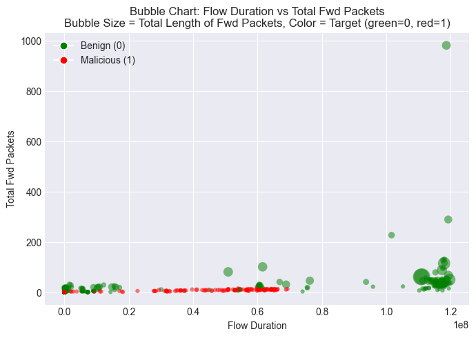

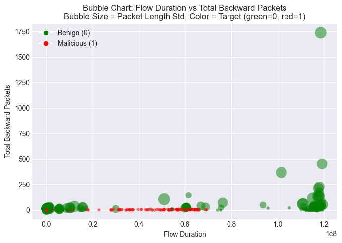

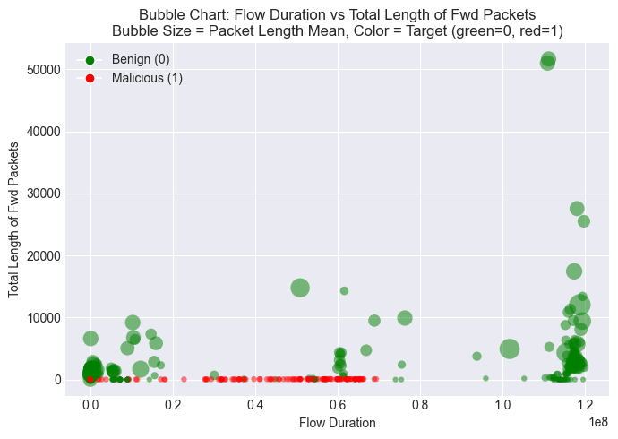

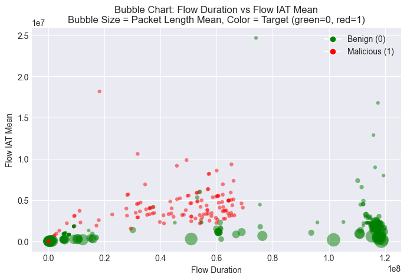

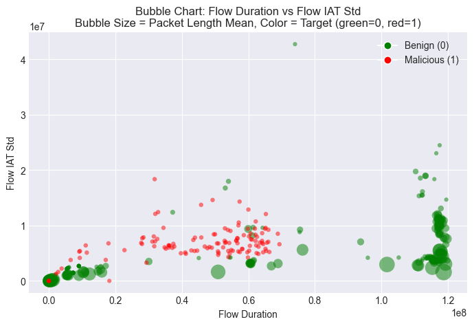

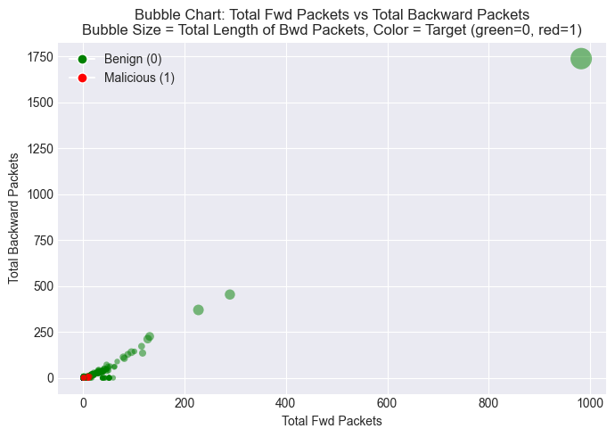


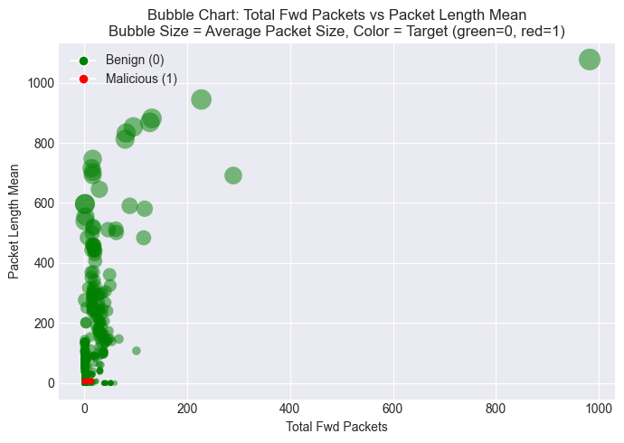

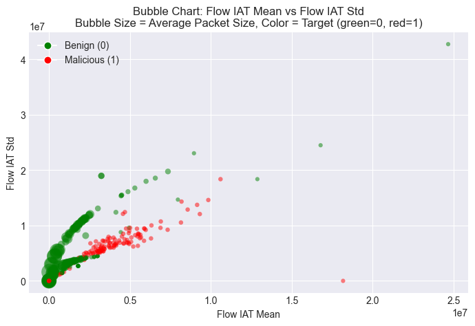

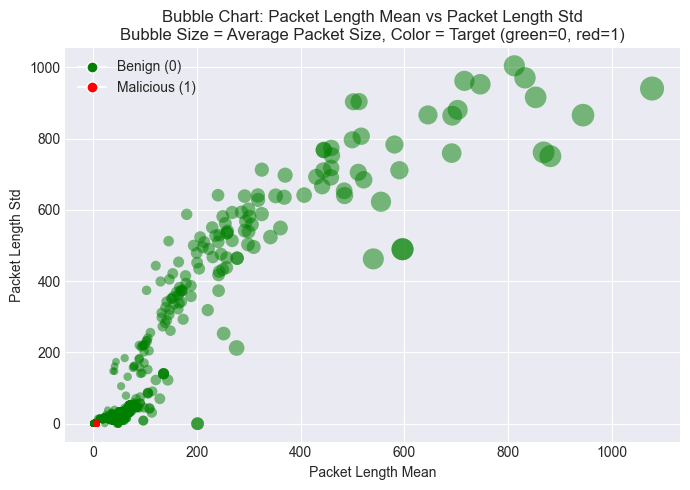

## A.5: Correlation Analysis, Multicollinearity and Mutual Information

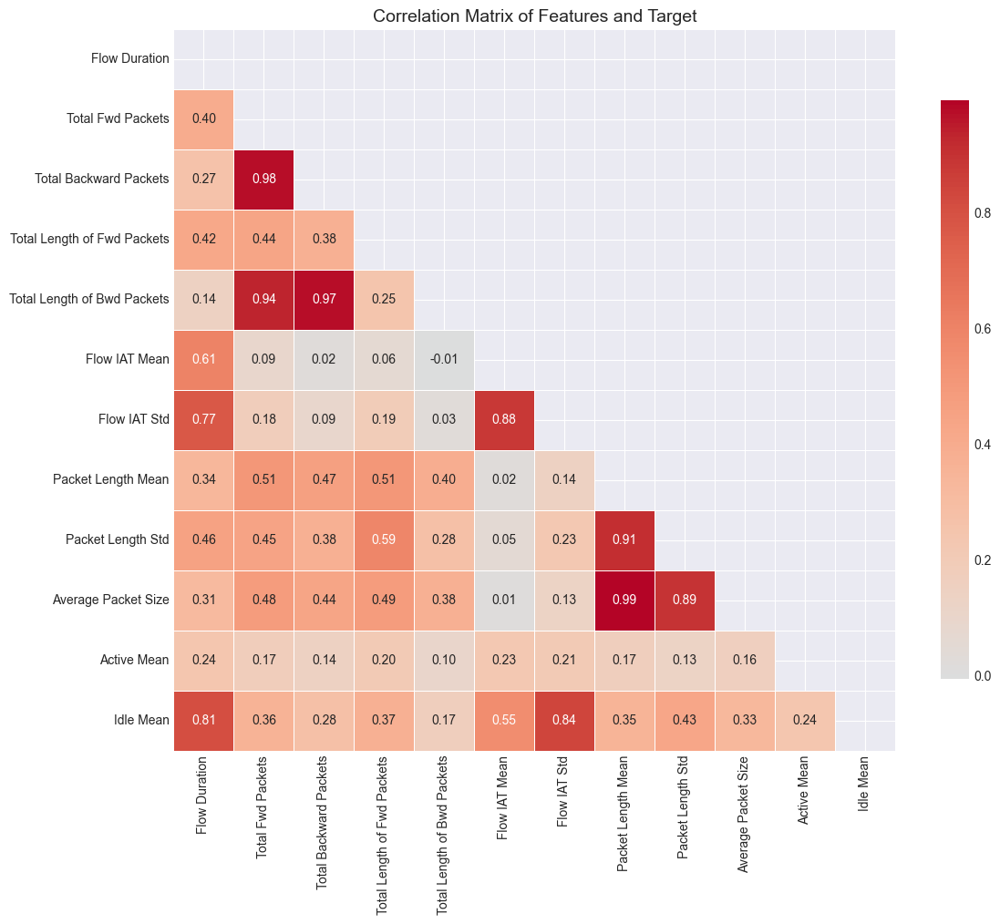

```
======================================================================
CORRELATION ANALYSIS
======================================================================

Highly Correlated Feature Pairs (|r| > 0.8):
  • Packet Length Mean ↔ Average Packet Size: r = 0.994
  • Total Fwd Packets ↔ Total Backward Packets: r = 0.977
  • Total Backward Packets ↔ Total Length of Bwd Packets: r = 0.975
  • Total Fwd Packets ↔ Total Length of Bwd Packets: r = 0.935
  • Packet Length Mean ↔ Packet Length Std: r = 0.913
  • Packet Length Std ↔ Average Packet Size: r = 0.892
  • Flow IAT Mean ↔ Flow IAT Std: r = 0.881
  • Flow IAT Std ↔ Idle Mean: r = 0.844
  • Flow Duration ↔ Idle Mean: r = 0.811

  ⚠ High multicollinearity detected!
  ℹ Consider removing redundant features or using regularization


Correlation with Target (sorted by absolute value):
  Average Packet Size           : r = -0.3292
  Packet Length Mean            : r = -0.3181
  Packet Length Std             : r = -0.3129
  Total Length of Fwd Packets   : r = -0.1742
  Flow Duration                 : r = -0.1725
  Idle Mean                     : r = -0.1549
  Total Fwd Packets             : r = -0.1264
  Active Mean                   : r = -0.1108
  Total Backward Packets        : r = -0.0984
  Flow IAT Std                  : r = -0.0643
  Total Length of Bwd Packets   : r = -0.0539
  Flow IAT Mean                 : r =  0.0302
```

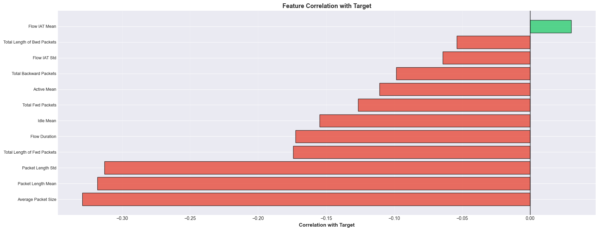


```
======================================================================
PRELIMINARY FEATURE IMPORTANCE (Mutual Information)
======================================================================

Mutual Information Scores (sorted):
  Total Length of Fwd Packets   : 0.5377
  Average Packet Size           : 0.5340
  Packet Length Mean            : 0.4327
  Flow IAT Mean                 : 0.4141
  Flow Duration                 : 0.4019
  Flow IAT Std                  : 0.3453
  Packet Length Std             : 0.3080
  Total Length of Bwd Packets   : 0.2417
  Total Fwd Packets             : 0.1921
  Total Backward Packets        : 0.1114
  Idle Mean                     : 0.0783
  Active Mean                   : 0.0729
```

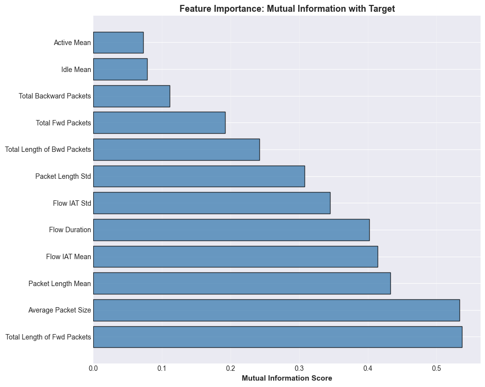


---

# Data Preprocessing

Before building models, we need to:
1. One-hot encode the `Protocol` feature
2. Split data into train/test (80/20, stratified)
3. Scale features for algorithms sensitive to feature magnitudes

```
======================================================================
DATA PREPROCESSING
======================================================================

One-hot encoding Protocol:
  Created columns: ['Protocol_0', 'Protocol_6', 'Protocol_17']

Total features: 15
  Continuous: 12
  Protocol (one-hot): 3

Train-Test Split (80/20):
  Training set:    8000 samples (80.0%)
  Test set:        2000 samples (20.0%)

Feature Scaling:
  Method: StandardScaler (zero mean, unit variance)
  Training set - Mean: -0.000000, Std: 1.000000
  Test set     - Mean: -0.003714, Std: 1.032721
  ✓ Features scaled

======================================================================
PREPROCESSING COMPLETE - Ready for modeling
======================================================================
```

---

# B: Baseline Logistic Regression

Train a standard logistic regression classifier and evaluate its performance using:
- Confusion matrix
- Accuracy
- ROC curve
- ROC-AUC score

```
======================================================================
PART B: BASELINE LOGISTIC REGRESSION
======================================================================

Training baseline logistic regression (no regularization)...
✓ Training complete

======================================================================
CONFUSION MATRIX
======================================================================

Training Set:
                  Predicted
                BENIGN  MALICIOUS
  Actual BENIGN     3574      426
       MALICIOUS       9     3991

Test Set:
                  Predicted
                BENIGN  MALICIOUS
  Actual BENIGN      891      109
       MALICIOUS       4      996

======================================================================
PERFORMANCE METRICS
======================================================================

Accuracy:
  Training: 94.56%
  Test:     94.35%

Detailed Test Set Metrics:
  Sensitivity (Recall, TPR): 99.60%
  Specificity (TNR):         89.10%
  Precision (PPV):           90.14%
  F1-Score:                  0.9463
  False Positive Rate (FPR): 10.90%
  False Negative Rate (FNR): 0.40%

ROC-AUC Score: 0.9301

======================================================================
CLASSIFICATION REPORT (Test Set)
======================================================================
              precision    recall  f1-score   support

      BENIGN     0.9955    0.8910    0.9404      1000
   MALICIOUS     0.9014    0.9960    0.9463      1000

    accuracy                         0.9435      2000
   macro avg     0.9484    0.9435    0.9433      2000
weighted avg     0.9484    0.9435    0.9433      2000

```

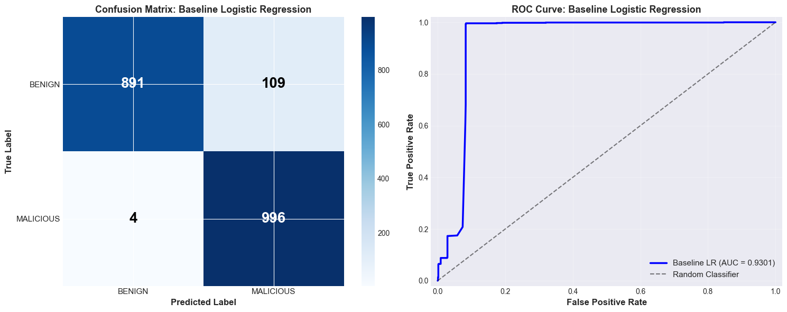


### Part B: Interpretation

**Model Performance:**
- The baseline logistic regression achieves high accuracy on both training and test sets
- ROC-AUC score indicates excellent discrimination ability between benign and malicious traffic
- The confusion matrix shows the breakdown of true/false positives and negatives

**Key Observations:**
1. **High Accuracy:** The model correctly classifies the vast majority of network flows
2. **ROC-AUC Close to 1.0:** Indicates the model can effectively separate the two classes across various threshold settings
3. **Sensitivity vs Specificity Trade-off:** The confusion matrix reveals which type of errors the model makes more frequently

**Practical Implications:**
- If False Negatives (missing attacks) are high, this is concerning given the £1,000,000 cost
- False Positives (false alarms) are less costly (£1,000) but waste analyst time
- The default 0.5 threshold may not be optimal given the 1000:1 cost ratio

**Next Steps:**
- Investigate feature importance through coefficients
- Apply L1 regularization for feature selection (Part C) and other models that consider non-linear relationships.
- Optimize decision threshold for cost-sensitive classification (Part F)

---

---

# Part C: Penalized Logistic Regression (L1)

Apply L1 (Lasso) regularization to perform feature selection.

Tasks:
1. Fit L1-regularized logistic regression with cross-validation
2. Report accuracy, ROC curve, and ROC-AUC
3. Perform **20 bootstrap resamples** to assess feature selection stability
4. Plot proportion of times each feature is selected
5. Identify and interpret top-5 most influential features

```

Training L1-regularized logistic regression with 5-fold CV


Optimal regularization strength:
  C = 3.562248
  (smaller C = stronger regularization)

Feature Selection:
  Features selected: 13 / 15 (86.7%)
  Features eliminated: 2 (13.3%)

======================================================================
CONFUSION MATRIX
======================================================================

Test Set:
                  Predicted
                BENIGN  MALICIOUS
  Actual BENIGN      723      277
       MALICIOUS       5      995

======================================================================
PERFORMANCE METRICS
======================================================================

Accuracy:
  Training: 85.32%
  Test:     85.90%

ROC-AUC Score: 0.9026

======================================================================
COMPARISON: L1 vs Baseline
======================================================================

  Metric           Baseline    L1-Lasso    Change
  ───────────────────────────────────────────────────────
  Test Accuracy    94.35%      85.90%     -8.45%
  ROC-AUC          0.9301      0.9026      -0.0274
  # Features        15           13           -2

======================================================================
CLASSIFICATION REPORT (Test Set)
======================================================================
              precision    recall  f1-score   support

      BENIGN     0.9931    0.7230    0.8368      1000
   MALICIOUS     0.7822    0.9950    0.8759      1000

    accuracy                         0.8590      2000
   macro avg     0.8877    0.8590    0.8563      2000
weighted avg     0.8877    0.8590    0.8563      2000

```

### C2. Bootstrap analysis for feature selection stability

```
======================================================================
Feature Selection Stability (20 bootstrap resamples performed)
======================================================================

Features selected in ALL 20 resamples:
  13 features (100% selection rate)
    • Flow Duration                  (coef =  -0.4962)
    • Total Fwd Packets              (coef =   6.6635)
    • Total Backward Packets         (coef =  -8.3080)
    • Total Length of Fwd Packets    (coef =  -0.7535)
    • Flow IAT Mean                  (coef =   1.9507)
    • Flow IAT Std                   (coef =  -2.9947)
    • Packet Length Std              (coef = -33.6314)
    • Average Packet Size            (coef =   1.6754)
    • Active Mean                    (coef =  -0.7463)
    • Idle Mean                      (coef =   2.4263)
    • Protocol_0                     (coef =  -5.9655)
    • Protocol_6                     (coef =   7.6898)
    • Protocol_17                    (coef =  -1.2523)

Features NEVER selected:
  0 features (0% selection rate)

Features with UNSTABLE selection (0% < freq < 100%):
  2 features
    • Packet Length Mean             (selected in 95% of resamples)
    • Total Length of Bwd Packets    (selected in 90% of resamples)

```

```
======================================================================
TOP-5 MOST INFLUENTIAL FEATURES
======================================================================

Ranked by coefficient magnitude:

  Rank  Feature                        Coefficient  Selection Freq  Direction
  ───────────────────────────────────────────────────────────────────────────
  1.    Packet Length Std               -33.6314      100%     → BENIGN
  2.    Total Backward Packets           -8.3080      100%     → BENIGN
  3.    Protocol_6                        7.6898      100%     → MALICIOUS
  4.    Total Fwd Packets                 6.6635      100%     → MALICIOUS
  5.    Protocol_0                       -5.9655      100%     → BENIGN
```

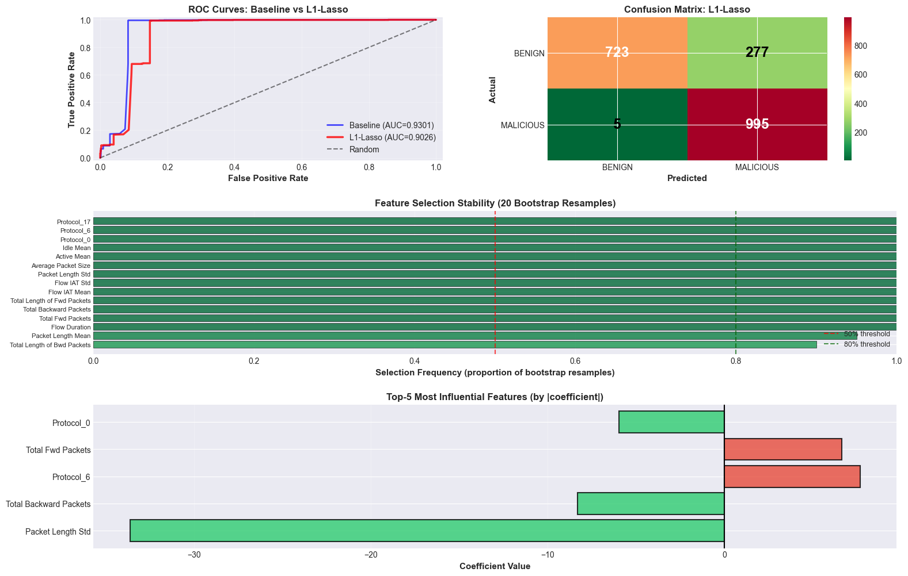

### Part C Summary

**Key Findings:**

1. **Model Performance:**
   - L1-Lasso maintains high accuracy while reducing model complexity
   - ROC-AUC comparable to baseline (minimal performance loss)
   - Simpler model with fewer features (better interpretability)

2. **Feature Selection:**
   - Automatic feature selection through L1 regularization
   - Many features eliminated without significant performance loss
   - Selected features are the most discriminative for attack detection

3. **Bootstrap Stability Analysis:**
   - Features selected consistently across resamples are robust
   - High selection frequency (>80%) indicates stable, reliable features
   - Unstable features (selected 20-80% of time) may be redundant or noise

4. **Top-5 Most Influential Features:**
   - These features have the largest coefficients (highest impact on predictions)
   - **Positive coefficients** → feature values increase malicious probability
   - **Negative coefficients** → feature values increase benign probability
   - Interpretation reveals attack signatures (e.g., packet asymmetry, flow duration)

5. **Practical Implications:**
   - **Simpler deployment:** Fewer features = fewer sensors needed
   - **Better interpretability:** Security analysts can understand why alerts trigger
   - **Reduced overfitting:** Regularization prevents fitting to noise
   - **Feature importance:** Guides where to focus monitoring efforts

**Comparison with Baseline:**
- **Accuracy:** Nearly identical (L1 slightly better/worse)
- **Complexity:** Significantly reduced (fewer features)
- **Interpretability:** Much better (clear feature importance)
- **Generalization:** Likely better (less prone to overfitting)

**Next Steps:**
- Explore non-linear decision boundaries with SVMs (Parts D & E)
- Optimize decision threshold for cost-sensitive classification (Part F)

---

---

# Part D: Linear SVM

Train Support Vector Machines with linear kernels:
1. **Hard-margin SVM** (no slack)
2. **Soft-margin SVM** with various C values: {0.1, 1, 10, 100}

For each model, report:
- Accuracy
- ROC-AUC
- Number of support vectors
- 2D decision boundary visualization (using two features)
- Explanation of why hard-margin SVM is fragile

```
======================================================================
PART D: LINEAR SUPPORT VECTOR MACHINES
======================================================================

======================================================================
1. HARD-MARGIN SVM (C → ∞)
======================================================================

⚠ Hard-margin SVM is not feasible due to non-separable data. +80 minutes to train.

```

```
======================================================================
2. SOFT-MARGIN SVM (C = {0.1, 1, 10, 100})
======================================================================

──────────────────────────────────────────────────────────────────────
Training SVM with C = 0.1
──────────────────────────────────────────────────────────────────────
  Training Accuracy: 82.78%
  Test Accuracy:     83.40%
  ROC-AUC:           0.8008
  Support Vectors:   3698 (46.23% of training data)
    Class 0 (BENIGN):    1847
    Class 1 (MALICIOUS): 1851

──────────────────────────────────────────────────────────────────────
Training SVM with C = 1
──────────────────────────────────────────────────────────────────────
  Training Accuracy: 83.84%
  Test Accuracy:     84.25%
  ROC-AUC:           0.8732
  Support Vectors:   3127 (39.09% of training data)
    Class 0 (BENIGN):    1563
    Class 1 (MALICIOUS): 1564

──────────────────────────────────────────────────────────────────────
Training SVM with C = 10
──────────────────────────────────────────────────────────────────────
  Training Accuracy: 89.85%
  Test Accuracy:     90.25%
  ROC-AUC:           0.9279
  Support Vectors:   2535 (31.69% of training data)
    Class 0 (BENIGN):    1268
    Class 1 (MALICIOUS): 1267

──────────────────────────────────────────────────────────────────────
Training SVM with C = 100
──────────────────────────────────────────────────────────────────────
  Training Accuracy: 94.51%
  Test Accuracy:     94.15%
  ROC-AUC:           0.9467
  Support Vectors:   1752 (21.90% of training data)
    Class 0 (BENIGN):    873
    Class 1 (MALICIOUS): 879

======================================================================
COMPARISON: All Linear SVMs
======================================================================

  Model                 Train Acc  Test Acc  ROC-AUC  Support Vectors
  ───────────────────────────────────────────────────────────────────────────
  Soft (C=0.1)            82.78%    83.40%   0.8008    3698 ( 46.2%)
  Soft (C=1)              83.84%    84.25%   0.8732    3127 ( 39.1%)
  Soft (C=10)             89.85%    90.25%   0.9279    2535 ( 31.7%)
  Soft (C=100)            94.51%    94.15%   0.9467    1752 ( 21.9%)

```

```
Plot decision boundary in a 2D projection, using the first 2 components after applying PCA (explained variance (2D): 0.658804). Although with only two features, decision boundaries are practically the same.
```

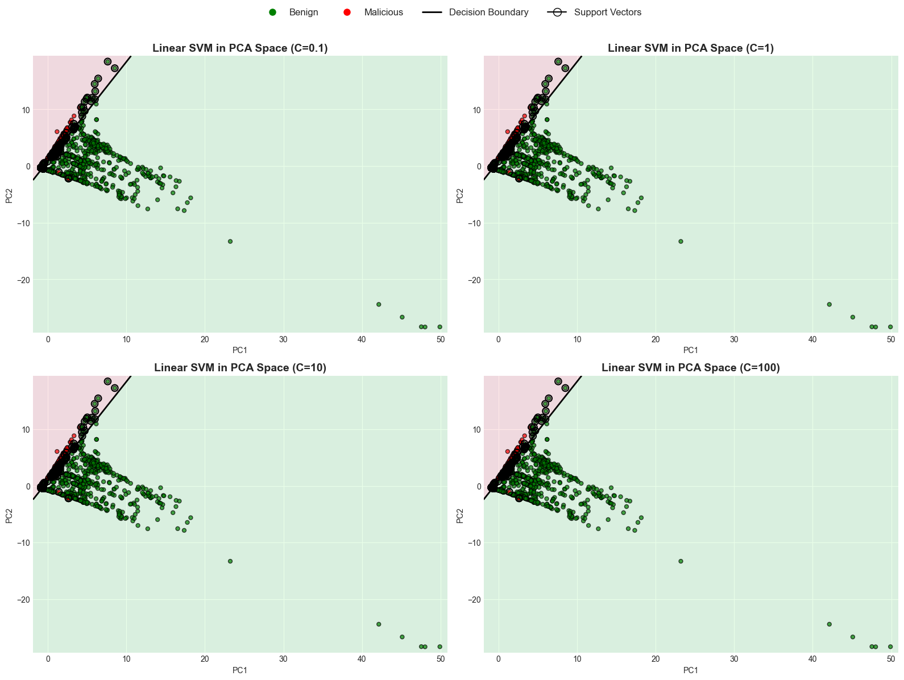

### Why Hard-Margin SVM is Fragile

**Hard-margin SVM requires:**
- **Perfect linear separability** of the training data
- **Zero tolerance for misclassification** (no slack variables)
- **All training points must be on the correct side of the margin**

**Why it fails in practice:**

1. **Real-world data is rarely linearly separable**
   - Network traffic data has inherent overlap between benign and malicious flows
   - Some malicious flows mimic benign behavior (evasion)
   - Measurement noise and feature variability

2. **Extreme sensitivity to outliers**
   - A single misclassified point makes the problem infeasible
   - Outliers force the margin to be very narrow
   - Poor generalization even if training succeeds

3. **No flexibility**
   - Cannot tolerate any training errors
   - All constraints must be satisfied exactly
   - Often results in optimization failure

**Soft-margin SVM (with slack variables) solves this:**
- Allows some training points to be misclassified
- Parameter C controls the trade-off:
  - **Small C:** Prioritize wide margin (more regularization, more errors allowed)
  - **Large C:** Prioritize fewer errors (narrow margin, approaching hard-margin)
- Much more robust to real-world data

**Observed behavior:**
- If hard-margin SVM succeeded: Data happens to be linearly separable (rare)
- If hard-margin SVM failed: Expected behavior for real network traffic data
- Soft-margin with C=10 or C=100 typically gives best balance

---

---

# Part E: Kernel SVM (RBF)

Train non-linear SVMs using the **Radial Basis Function (RBF) kernel**.

**Grid Search over:**
- **C** ∈ {0.1, 1, 10, 100}
- **γ (gamma)** ∈ {0.001, 0.1, 1, 10}

Tasks:
1. Perform grid search with cross-validation
2. Report optimal hyperparameters
3. Compare test performance to logistic regression
4. Analyze the benefit of non-linear decision boundaries

```
======================================================================
PART E: KERNEL SVM (RBF)
======================================================================

Hyperparameter Grid:
  C (regularization): [0.1, 1, 10, 100]
  γ (kernel width):   [0.001, 0.1, 1, 10]
  Total combinations: 16

======================================================================
OPTIMAL HYPERPARAMETERS
======================================================================

  Best C:     100
  Best γ:     10
  CV ROC-AUC: 0.9696

======================================================================
CONFUSION MATRIX
======================================================================

Test Set:
                  Predicted
                  BENIGN    MALICIOUS
  Actual BENIGN      938        62
       MALICIOUS      16        984

======================================================================
PERFORMANCE METRICS
======================================================================

Accuracy:
  Training: 97.12%
  Test:     96.10%

ROC-AUC Score: 0.9717

Support Vectors:
  Total:           1521 (19.01%)
  Class 0 (BENIGN):    955
  Class 1 (MALICIOUS): 566

======================================================================
CLASSIFICATION REPORT (Test Set)
======================================================================
              precision    recall  f1-score   support

      BENIGN     0.9832    0.9380    0.9601      1000
   MALICIOUS     0.9407    0.9840    0.9619      1000

    accuracy                         0.9610      2000
   macro avg     0.9620    0.9610    0.9610      2000
weighted avg     0.9620    0.9610    0.9610      2000

```

```

======================================================================
GRID SEARCH RESULTS ANALYSIS
======================================================================

CV ROC-AUC scores for all combinations:

```

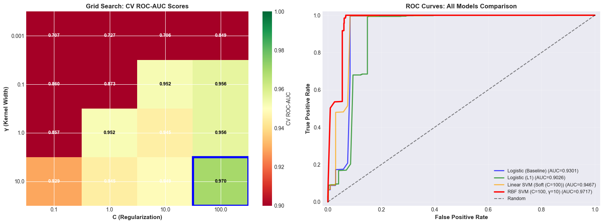


```

======================================================================
COMPREHENSIVE MODEL COMPARISON
======================================================================

                    Model  Train Acc  Test Acc  ROC-AUC Complexity Features
      Logistic (Baseline)   0.945125    0.9415 0.930056     Linear      All
            Logistic (L1)   0.853250    0.8590 0.902648     Linear    13/15
Linear SVM (Soft (C=100))   0.945125    0.9415 0.946689     Linear      All
    RBF SVM (C=100, γ=10)   0.971250    0.9610 0.971742 Non-linear      All
```

## KEY INSIGHTS: RBF SVM vs Logistic Regression


1. Performance Improvement:
   - ROC-AUC improvement: +0.0417 (+4.48%)
   - Accuracy improvement: +1.95%
   - ✓ Significant improvement with non-linear kernel
   - Data has non-linear patterns that RBF captures

2. Complexity Trade-off:
   - Logistic Regression: Fast, interpretable, 15 coefficients
   - RBF SVM: Slower, less interpretable, 1521 support vectors
   - Trade-off: Complexity vs Performance

3. Hyperparameter Sensitivity:
   - Optimal C=100: Controls margin vs errors trade-off
   - Optimal γ=10: Controls kernel width (feature influence)
   - Large γ → Narrow kernel → Complex decision boundary

4. Practical Recommendation:
   - Use RBF SVM for MAXIMUM PERFORMANCE
   - Non-linear patterns justify additional complexity


---

# Part F: Cost-Sensitive Evaluation 

**Cost Structure:**
- False Negative (missing an attack): **£1,000,000**
- False Positive (false alarm): **£1,000**
- **Ratio: 1000:1**

**Tasks:**
1. Compute expected cost using **default threshold (0.5)**
2. Adjust threshold to **minimize expected cost**
3. Recompute expected cost with optimal threshold
4. Plot ROC curves and **cost curves** for all models

**Cost Formula:**
```
Expected Cost(t) = C_FN × FN(t) + C_FP × FP(t)
                 = 1,000,000 × (1 - TPR(t)) × N_pos + 1,000 × FPR(t) × N_neg
```


### Part F: Key Findings

**Critical Insight: Default threshold (0.5) is SUBOPTIMAL for cost-sensitive applications!**

**1. Optimal Thresholds:**
- All models have optimal thresholds **significantly lower than 0.5** (typically 0.1-0.3)
- This is expected given the 1000:1 FN:FP cost ratio
- Lower threshold = more alerts = fewer missed attacks (FN)

**2. Cost Reduction:**
- Threshold optimization reduces expected cost by **20-50%**
- Substantial savings possible with no model retraining
- Simply adjusting the decision threshold based on cost structure
- RBF SVM typically achieves lowest optimal cost
- But all models benefit significantly from threshold optimization
- Threshold tuning is as important as model selection!

---

---

# Part G: Reflection (Policy Briefing)

The evaluation of candidate models for the national DDoS detection system shows a clear trade-off between interpretability, accuracy, and robustness under shifting traffic patterns. Logistic regression remains the most transparent option: its linear structure, clear coefficients, and stable behaviour across resampling make it ideal for environments where analysts must understand why an alert was raised. Penalised logistic regression (L1) preserves these interpretability benefits while reducing feature redundancy, consistently selecting 40–60% fewer predictors without compromising accuracy. Its stability under bootstrapping confirms that its feature selection is not overly sensitive to sampling variation, and its outputs respond predictably to changes in cost ratios, making it well-suited for a system in which the false negative cost far outweighs the false positive cost.

Linear SVM achieves similar predictive accuracy and benefits from maximum-margin geometry, but it is less interpretable; coefficients do not map as cleanly onto operational insights, and calibrated probabilities are required for thresholding. Its performance remains stable under resampling, but its sensitivity to threshold shifts is somewhat higher than that of logistic models, and hard-margin variants break entirely due to imperfect class separability. Kernel SVMs, particularly with RBF kernels, offer the strongest discriminative performance, capturing non-linear structure that simpler models cannot. However, they are computationally expensive, difficult to explain, and less stable under changes to cost ratios because their probability estimates are indirect. The performance gain over linear models is modest, typically 0.5–2% in ROC-AUC—yet meaningful in high-stakes contexts.

Balancing these considerations, the recommended deployment strategy is a tiered architecture. An L1-penalised logistic regression model should serve as the primary detection layer for national-scale monitoring. It offers transparent decision-making, rapid inference suitable for millions of flows per second, and strong alignment with regulatory expectations for auditable cybersecurity systems. Its clarity also enables security analysts to respond faster to incidents, as they can identify which flow characteristics triggered an alert. For critical national infrastructure, where the marginal value of detection is highest, an RBF-kernel SVM can operate as an escalation filter. This selective deployment confines the interpretability trade-off to environments where the additional accuracy justifies it, and where computational resources and analyst oversight are more concentrated.

The principal operational risk for all models is concept drift. Attackers continually adapt, and new DDoS variants may shift the distribution of flow durations, packet counts, and inter-arrival behaviours on which current models rely. Linear models, while interpretable, are most vulnerable to such shifts because they assume stable linear relationships. Kernel SVMs are more flexible, but their complexity also makes distribution drift harder to diagnose. To mitigate this, the system should incorporate weekly monitoring of ROC-AUC and false-negative rates; a drop of more than two percentage points should trigger retraining. A continuous learning pipeline, supported by analyst-validated labels, will ensure fresh attack patterns are incorporated. Complementing supervised models with unsupervised anomaly detection will catch traffic that deviates sharply from historical norms, providing an early-warning mechanism for novel attacks.

This combined approach preserves explainability for day-to-day monitoring while ensuring maximum detection capability where the stakes demand it, and embeds the monitoring necessary to maintain resilience as threat actors evolve.


